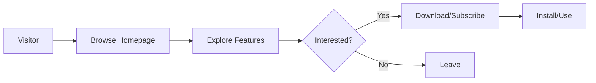

## 1. Product Overview
神州智能体官网 - 未来科技风格的AI智能体产品展示网站，采用红白渐变色调，展示本地化部署和自动化工作流功能。

## 2. Core Features

### 2.1 User Roles
| Role | Registration Method | Core Permissions |
|------|---------------------|------------------|
| Visitor | No registration | Browse all content |
| Developer | Email registration | Access developer resources |
| Subscriber | Paid subscription | Premium features |

### 2.2 Feature Module
1. **Home page**: Hero section, navigation, features showcase, CTA
2. **Features page**: Local deployment, workflow automation details
3. **Ecosystem page**: Plugin ecosystem, integrations
4. **Developer page**: API docs, SDK resources
5. **Community page**: Forum, discussions

### 2.3 Page Details
| Page Name | Module Name | Feature description |
|-----------|-------------|---------------------|
| Home | Hero | Animated hero section with brand statement |
| Home | Navigation | Fixed nav with scroll effects |
| Home | Features | Local deployment and automation showcase |
| Features | Local Deployment | Self-hosted, privacy-first AI |
| Features | Workflow Automation | Auto-integration with daily tools |
| Ecosystem | Plugins | Extensible plugin system |

## 3. Core Process

## 4. User Interface Design
### 4.1 Design Style
- Primary colors: Red (#DC2626) to white (#FFFFFF) gradient
- Secondary colors: Dark accents (#1F2937)
- Button style: Gradient, rounded-full, hover animations
- Font: Modern sans-serif (Inter)
- Layout: Clean, futuristic, card-based

### 4.2 Page Design Overview
| Page Name | Module Name | UI Elements |
|-----------|-------------|-------------|
| Home | Hero | Animated gradient background, floating elements, CTA buttons |
| Home | Features | Feature cards with icons, hover effects |
| Home | Footer | Navigation links, social icons |

### 4.3 Responsiveness
Desktop-first design with mobile-adaptive layout, touch optimization for all interactive elements.

### 4.4 3D Scene Guidance
- Animated floating particles for background
- Smooth scroll animations
- Micro-interactions on hover
